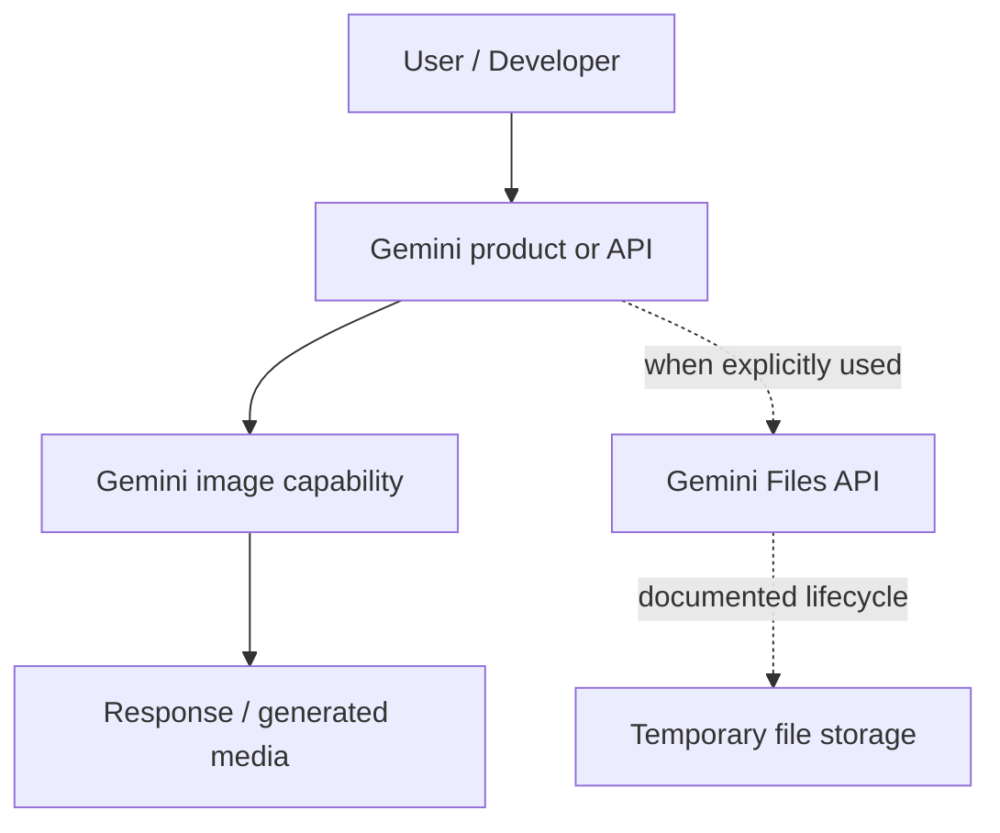
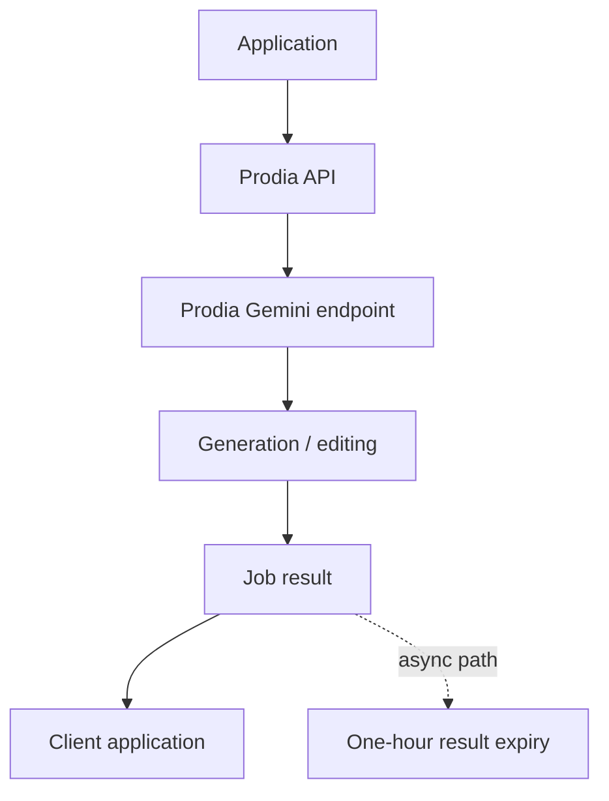
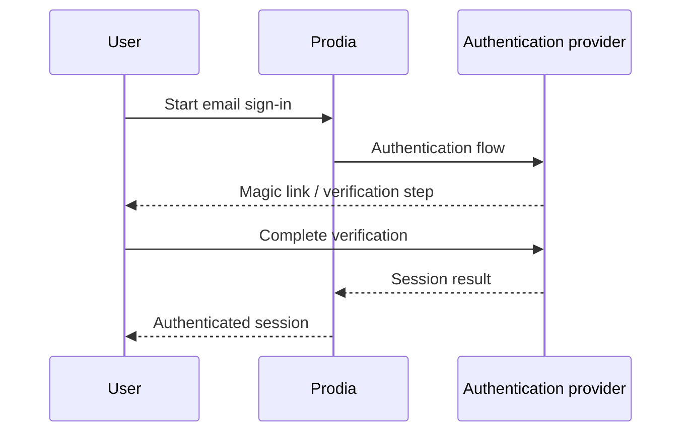
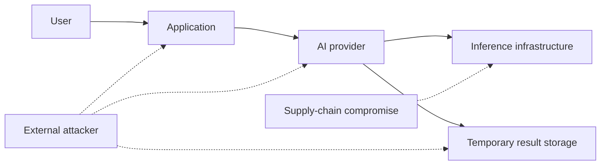

<div align="center">

# Where Does Gemini Store Images?

### Gemini image infrastructure, Prodia, retention, authentication, and AI security research

<p>
  
  
  
  
</p>

<p>
  <a href="#research-question">Research question</a> ·
  <a href="#current-finding">Current finding</a> ·
  <a href="#visual-research-map">Research map</a> ·
  <a href="#evidence-status">Evidence</a> ·
  <a href="#research-documents">Documents</a> ·
  <a href="#reproduce-the-research">Reproduce</a>
</p>

</div>


> **Research type:** independent security research and public-source investigation  
> **Status:** active  
> **Last reviewed:** 29 September 2026  
> **Author:** [Your Name / GitHub Handle]

## Why this repository exists

This project investigates how image data moves through the Gemini ecosystem and where third-party AI infrastructure may fit into that path.

The main subjects are **Google Gemini image generation and editing, Prodia Gemini endpoints, temporary image storage, API authentication, Stytch authentication flows, data retention, cloud infrastructure, privacy, network analysis, and third-party AI supply-chain risk**.

The project is intentionally evidence-driven. A documented API behavior is not treated as proof of Google's private backend architecture, and a browser observation is not treated as proof of every server-to-server request behind it.

---

## Research question

> **When a user uploads or edits an image with Gemini, where does that image go, and can public or reproducible technical evidence show that Prodia is part of the first-party Gemini image workflow?**

A second question follows from that:

> **What security and privacy trust boundaries appear when the same Gemini image models are exposed through a third-party API such as Prodia?**

### Systems kept separate in this research

| System | What is being investigated |
|---|---|
| **Gemini consumer products** | Browser-visible behavior and documented consumer data handling |
| **Gemini API / Files API** | Upload behavior, file lifecycle, and documented retention |
| **Google AI Studio / Google Cloud** | Developer-facing model access and infrastructure relationships |
| **Prodia API** | Gemini image endpoints, image-to-image processing, job results, and API behavior |
| **Prodia authentication** | Login flow, magic links, sessions, and observed authentication providers |

---

## Current finding

> **Public evidence establishes that Prodia exposes Google's Gemini image models through its own API. It does not currently establish that Google's first-party Gemini consumer service uses Prodia as its image-processing or image-storage backend.**

That wording is deliberately narrow. The repository can change its conclusion when new evidence is collected.

### What is already documented

- Google documents the Nano Banana model family and its current model mappings.
- Prodia documents Gemini image endpoints and image-to-image workflows.
- Prodia documents one-hour expiry for asynchronous job results.
- Google's Gemini Files API documents a 48-hour lifecycle for uploaded Files API files.
- Google Cloud publicly discusses Prodia using Google Cloud infrastructure.

### What remains open

- Whether any first-party Gemini workflow sends image data to Prodia.
- Whether Prodia is ever an undisclosed subprocesser or inference provider for a Google product.
- What happens inside Google or Prodia infrastructure after the browser-visible part of a request ends.
- Whether different products, accounts, regions, or experiments take different paths.

---

## Model name is not infrastructure identity

The same image model can appear in multiple products and APIs.

```text
Model identity
      |
      +------ does not prove ------> Application identity
                                      |
                                      +------ does not prove ------> Backend identity
                                                                     |
                                                                     +-----> Storage identity
```

That is one of the central rules of this research.

### Current Nano Banana mapping

| Google product name | Model |
|---|---|
| Nano Banana | Gemini 2.5 Flash Image |
| Nano Banana Pro | Gemini 3 Pro Image |
| Nano Banana 2 | Gemini 3.1 Flash Image |
| Nano Banana 2 Lite | Gemini 3.1 Flash-Lite Image |

---

## Evidence status

| Research claim | Status | Evidence class |
|---|---|---|
| Google documents Nano Banana image models | Confirmed | DOCUMENTED |
| Prodia exposes Gemini image models | Confirmed | DOCUMENTED |
| Prodia supports Gemini image-to-image workflows | Confirmed | DOCUMENTED |
| Prodia async job results expire after one hour | Confirmed | DOCUMENTED |
| Gemini Files API uploads are deleted after 48 hours | Confirmed | DOCUMENTED |
| Google Cloud publicly describes Prodia infrastructure | Confirmed | DOCUMENTED |
| `gemini.google.com` sends image requests to Prodia | Not established | UNKNOWN |
| Prodia is Google's consumer Gemini image-storage backend | Not established | UNKNOWN |
| `images.prodia.com` is a universal Prodia image CDN | Not established | UNKNOWN |
| API expiry equals complete physical deletion | Not established | UNKNOWN |
| Prodia's use of Stytch means Stytch receives AI image data | Not established | UNKNOWN |

See the full [evidence matrix](research/evidence-matrix.md) for source-by-source reasoning.

---

## Research status

| Track | Status |
|---|---|
| Public-source review | ✅ Done |
| Nano Banana model mapping | ✅ Done |
| Prodia API documentation review | ✅ Done |
| Retention comparison | ✅ Done |
| Threat modeling | ✅ Done |
| Stytch authentication research | 🟡 In progress |
| First-party Gemini network testing | 🟡 In progress |
| Repeatable TEST-001 capture | ⏳ Next |
| Server-to-server architecture verification | ❓ Not externally visible yet |

---

## Visual research map

The repository contains source Mermaid diagrams and renders the most important flow directly below.

### 1. Google-side flow



[Open the Mermaid source: `diagrams/google-flow.mmd`](diagrams/google-flow.mmd)

### 2. Prodia flow



[Open the Mermaid source: `diagrams/prodia-flow.mmd`](diagrams/prodia-flow.mmd)

### 3. Authentication flow



[Open the Mermaid source: `diagrams/authentication-flow.mmd`](diagrams/authentication-flow.mmd)

### 4. Threat model



[Open the Mermaid source: `diagrams/threat-model.mmd`](diagrams/threat-model.mmd)

For the complete diagram set, see [`diagrams/`](diagrams/) or the [diagram gallery](docs/diagram-gallery.md).

---

## Retention: do not collapse everything into one number

Several documented mechanisms exist and should be kept separate.

| System | Documented behavior | What that does **not** prove |
|---|---|---|
| Gemini Files API | Uploaded Files API files are deleted after 48 hours | That every Gemini image uses the Files API |
| Gemini Apps | Consumer activity follows a separate retention model | That it matches Files API behavior |
| Prodia Async API | Async job results expire after one hour | That every cache, backup, log, or storage layer is deleted at the same time |

Read the detailed [retention analysis](docs/retention.md).

---

## The Stytch question

The repository also tracks `stytch.com` appearing in the Prodia sign-in experience.

The current research position is simple:

> Seeing an authentication provider in a login flow is evidence about the authentication path. It is not, by itself, evidence about the image inference or storage path.

The investigation therefore keeps authentication and image processing as separate trust boundaries.

Read [authentication and Stytch research](docs/authentication-stytch.md).

---

## Security questions this project can test

- What domains are contacted during an image upload or edit?
- Which requests are browser-visible and which may be backend-only?
- What headers and content types are used for image input and output?
- Are image results returned as bytes, URLs, or job resources?
- How long are documented job resources available?
- What happens to metadata such as EXIF after processing?
- What authentication state is established before an image job can run?
- Does a repeatable browser trace show any Prodia-controlled endpoint?
- Can the same behavior be reproduced across multiple tests?

These are research questions, not claims that a vulnerability exists.

---

## Research methodology

The project uses a simple evidence chain:

```text
Observation
    ↓
Evidence
    ↓
Interpretation
    ↓
Conclusion
```

### Evidence labels

- **DOCUMENTED**: directly stated in an authoritative source.
- **OBSERVED**: collected during a controlled test.
- **CORROBORATED**: supported by multiple independent sources.
- **INFERRED**: a technical interpretation that is not directly documented.
- **HYPOTHETICAL**: a threat or test scenario.
- **UNKNOWN**: the available evidence cannot answer it.

Read the full [methodology](research/methodology.md) and [network-testing guide](research/network-testing.md).

---

## Research documents

### Core analysis

- [Executive summary](docs/executive-summary.md)
- [Prodia investigation](docs/prodia-investigation.md)
- [Google Gemini data handling](docs/google-gemini-data-handling.md)
- [Architecture analysis](docs/architecture.md)
- [Data flow analysis](docs/data-flow.md)
- [Retention analysis](docs/retention.md)
- [Privacy analysis](docs/privacy.md)
- [Image security](docs/image-security.md)
- [Third-party AI risk](docs/third-party-risk.md)
- [Threat model](docs/threat-model.md)
- [Authentication and Stytch](docs/authentication-stytch.md)
- [Limitations](docs/limitations.md)

### Research operations

- [Evidence matrix](research/evidence-matrix.md)
- [Sources](research/sources.md)
- [Methodology](research/methodology.md)
- [Authorized network testing](research/network-testing.md)
- [Hypotheses](research/hypotheses.md)
- [Unanswered questions](research/unanswered-questions.md)
- [TEST-001 observation template](research/observations/test-001-template.md)

### Findings

- [Confirmed findings](findings/confirmed-findings.md)
- [Unverified claims](findings/unverified-claims.md)
- [Limitations](findings/limitations.md)

---

## Reproduce the research

The next useful step is a controlled network test using:

1. your own account,
2. your own browser or device,
3. a synthetic image,
4. a single controlled image-generation or editing action,
5. a clean network capture.

Record the browser, application, region, test image SHA-256, contacted domains, request methods, relevant response headers, and the observed output location.

Do not publish cookies, bearer tokens, API keys, session identifiers, private images, or other credentials.

Start with [`research/observations/test-001-template.md`](research/observations/test-001-template.md).

---

## Repository topics and search terms

Suggested GitHub topics for this project:

`cybersecurity` `ai-security` `ai-privacy` `google-gemini` `gemini` `prodia` `cloud-security` `privacy-research` `security-research` `network-analysis` `data-flow` `threat-modeling` `osint` `image-security` `ai-infrastructure`

The repository description should be:

> Independent cybersecurity research into Gemini image handling, Prodia infrastructure, authentication, retention, data flows, and third-party AI security.

See [`docs/github-repository-setup.md`](docs/github-repository-setup.md) for the exact GitHub metadata and social-preview setup, or run [`scripts/set-github-metadata.ps1`](scripts/set-github-metadata.ps1) after authenticating with GitHub CLI.

---

## Research boundaries

This project does not attempt to access another user's data, bypass authentication, intercept credentials, exploit production systems, or infer private architecture from a single hostname.

The project is intended as independent academic-style security research and public-source investigation.

## License

MIT. See [`LICENSE`](LICENSE).
